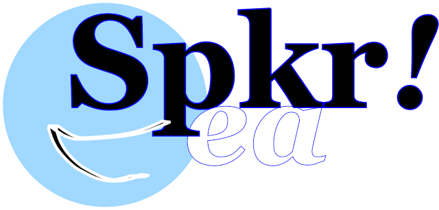

As this is a class project that will probably have very few actual users, the 
following policy is not intended to actually be legally binding. In the unlikely 
event this becomes something that stays active beyond the duration of the 
training, the following fake legal document would be replaced with an actually 
enforceable contract.

# End User License Agreement

Speakr is licensed to You (End User) by Speakr Social Media PLLC, located and 
registered at 123 Fake Street, Springfield IL 62629, USA (Licensor), for use 
only under the terms of this License Agreement.

## The application

TODO: Write this section

## Scope of license

TODO: Write this section

## Technical requirements

TODO: Write this section

## Maintenance and support

TODO: Write this section

## User-generated content

TODO: Write this section

## Content license

TODO: Write this section

## Liability

TODO: Write this section

## Warranty

TODO: Write this section

## Product claims

TODO: Write this section

## Legal compliance

TODO: Write this section

## Contact information

TODO: Write this section

## Termination

TODO: Write this section

## Third party terms of agreements and beneficiary

TODO: Write this section

## Intellectual property rights

TODO: Write this section

## Applicable law

TODO: Write this section

## Miscellaneous

TODO: Write this section
